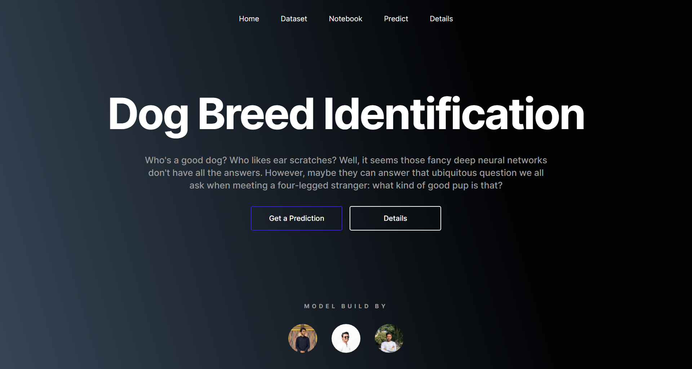
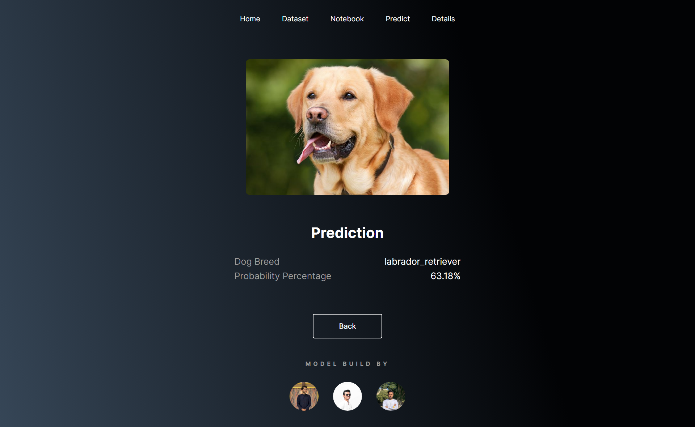

# Dog Breed Identification
Our TensorFlow Keras-based machine learning model is designed to accurately detect dog breeds in images. With a focus on supervised learning, the model is trained on a labeled dataset that includes a diverse range of dog breeds. This approach allows the model to learn unique features and traits associated with each breed, which it then uses to classify new images.

We are provided with a training set and a test set of images of dogs. Each image has a filename that is its unique id. The dataset comprises 120 breeds of dogs. The goal of the work is to create a classifier capable of determining a dog's breed from a photo.

| Breeds      |                                                             120 |
|-------------|----------------------------------------------------------------:|
| Valid       |                                                             120 |
| Mismatched  |                                                               0 |
| Missing     |                                                               0 |
| Most Common | Scottish_Deerhound  1% Maltese_Dog 1% Others (9979) 98% |

| Values (Images) |  10,222 |
|-----------------|--------:|
| Valid           |   10.2k |
| Mismatched      |       0 |
| Missing         |       0 |

 

- **[Dataset at Kaggle](https://www.kaggle.com/competitions/dog-breed-identification/data)**
- **[Notebook](https://www.kaggle.com/code/abdulrehmandev/dog-breed-identification)**

## Setup
Download the project form the `code > download` or use `git clone https://github.com/abdulrehmandev/dog-breed-classifier.git` to clone this repository to your local machine.
Then `cd dog-breed-identification` to change the directory to the project folder and run `scripts/activate` to activate the virtual environment. Make sure you have all the libraries installed before running the app. To run the app use `flask run`. The app will start listening on the port 5000.

## Breed Predictor App

